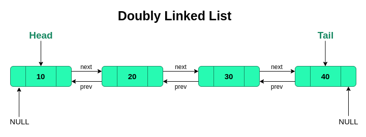

# Python 

Bu yerda siz o'rganib borayotgan ma'lumotlar tuzilmalari va algoritmlarning **Python** dasturlash tilidagi kod implementatsiyasini
ko'rib o'rganib chiqsangiz bo'ladi. Biz imkon qadar kodlarni sizga tushuntirishga va sizni tasavvuringizni uyg'otishga harakat qilamiz.
Har bir mavzuga tegishli kodlarni shu yerdan topishingiz mumkin. Agar sizga boshqa bir mavzu kerak bo'lsa o'ng tomondagi menu orqali
o'zingiz hohlagan mavzuga tez o'tishingiz mumkin.

Har bir kodni ustida komment orqali u nima vazifa bajarishini yozib o'tishga harakat qilamiz. Uni o'zingiz ham sinab ko'rishni unutmang!

## Big O

Big O notationda o'rgangan bilimlaringizni keling endi amaliyotlarda misollar bilan ko'rib chiqamiz va biz odatiy yozadigan kodlarimizni
analiz qilishni o'rganamiz. Misol uchun pastdagi kodga e'tibor bering:

```python showLineNumbers filename="main.py"
def juftlar(arry: list[int]) -> list:
    result = []
    for num in arry:
        if num % 2 == 0:
            result.append(num)
    return result
```

Yuqoridagi kodning Time va Space Complexitysi nima deb o'ylaysiz? Keling tahlil qilamiz. Bu yerda for loop bor  demak bizni kodimiz
linear harakat qiladi ya'ni bu qandaydir shartlar asosida emas berilgan uzunlik asosida birma-bir iteratsiya bo'ladi. Shuning xisobiga
ko'ra bu `n` marta harakat qilayabdi. Ochilgan List esa har bir element uchun bitta xotira sarflaydi. Agar funksiyaga berilgan array 
ichida faqat juft sonlar bo'lsa loop barcha listni iteratsiya qiladi. Biz shu tomonini ham o'ylagan holda uni ham `n` ta element oladi
deb xisoblaymiz.

**Time**: O(n)

**Space** : O(n)

---

Keling endi keyingi misolga to'xtasak:

```python showLineNumbers filename="main.py"
def access_element(arr: list, index : int) -> any:
    return arr[index]
```
Ushbu misolda bizning funksiya List olib uning berilgan indeksidagi elementni qaytarayabdi. Listlarda indeksga kirish uchun ketkaziladigan 
vaqt O(1) bo'ladi. Xotira esa bu yerda 1 chunki biz hech qanday yangi data type yaratmayabmiz. Demak xulosa:

**Time**: O(1)

**Space** : O(1)

---

```python showLineNumbers filename="main.py"
def summing(numbers: list) -> int:
    result = 0
    for num in numbers:
        result += num
    return result
```

Mana bu misolga qaraylik, bu yerda vaziyat biroz boshqacha endi biz `result` o'zgaruvchisini increment qilayabmiz. Ya'ni ortiqcha 
o'zgaruvchilar ochmagan holda faqat `result` ustida amal qilib yana unga qiymat saqlayabmiz (shunchaki update qilayabmiz). Shuni 
inobatga olgan holda bu yerda space O(1) ga, time esa O(n) ga teng. Chunki bizning loop `n`ta amal bajaradi eng ko'pi bilan.

Bunday misollarni ko'plab keltirishimiz mumkin ammo keling endi qolganlarini yo'l-yo'lakay ko'rib tahlil qilib ketamiz...

## Array

Python dasturlash tilida Array degan built-in data structure mavjud emas ammo uning ekvivalenti bor u esa **List**.

> List - turli xil data typedagai ma'lumotlarni saqlab turuvchi konteyner xisoblanadi.

```python showLineNumbers filename="main.py"
# Pythonda List yaratish:
my_list = ['o', 'apple', 17, 3.14]

# Bo'sh list yaratish:
new_list = list() 

# yoki
new_list = []
```

### List metodlari


Yuqoridagi rasmda ba'zi metodlar keltirilgan ularni shunchaki ko'rib emas balkim ishlatib ko'rishni ham maslahat beraman. Agar siz ko'proq
metodlar haqida o'rganmoqchi bo'lsangiz [Python dokumentatsiyasida](https://docs.python.org/3/tutorial/datastructures.html) ko'proq yoritib o'tilgan.

### Indexes


List ichidagi elementlarni access qilish ya'ni kirish uchun biz **index**lardan foydalanamiz. Yuqoridagi rasmda ko'rib turganingizdek sanoq 1 
dan emas 0 dan boshlangan.

> **Xazil**: Agar sizga biror dasturchi sen mening birinchi muhabbatimsan desa ishonmang. Chunki dasturlashda sanoq 0dan boshlanadi. 😌

```python showLineNumbers filename="main.py"
nums = [3, 8, 1, 0, 5, -2, 32] # Rasmdagi list 

print(nums[3]) # List ichidan 3chi indeksdagi qiymatni oldik.
```

### Slicing

Tasavvur qiling sizda 100ta elementli list bor ammo sizga uni faqat 20-50 ideks oralig'idagi qiymatlari kerak. Bunday holatda sizga 
listdagi qiymatlarni o'chirish emas balkim shunchaki uni bo'laklarga bo'lish kifoya qiladi.


```python showLineNumbers filename="main.py"
list[start:stop:step]
# start - boshlang'ich nuqta
# step - tugash nuqtasi
# step - qadam
ls = [1, 2, 3, 4, 5, 6, 7, 8, 9, 10] 

ls[2:]    # [3, 4, 5, 6, 7, 8, 9, 10]
ls[1:6]   # [2, 3, 4, 5, 6]
ls[:5]    # [1, 2, 3, 4, 5]
ls[1:4:2] # [2, 4]
ls[::2]   # [1, 3, 5, 7, 9]
ls[::-1]  # [10, 9, 8, 7, 6, 5, 4, 3, 2, 1]
ls[::-2]  # [10, 8, 6, 4, 2]
```

Yuqorida keltirilgan misollarni tushunishlik uchun ozgina tahlil qilib o'zingiz ham mashq qilib ko'ring.

### Python Array

Pythonda Array bor va uni yaratish uchun yoki tushunish uchun siz shunchaki **[array](https://docs.python.org/3/library/array.html)** Python 
Standart Library ishlatishingiz kerak:

```python showLineNumbers filename="main.py"
from array import array

nums = array('l', [1, 2, 3, 4, 5]) 

nums.append(0) # array('l', [1, 2, 3, 4, 5, 0]) 
nums.remove(3) # array('l', [1, 2, 4, 5, 0]) 
...

print(nums[2]) # 4
# Qolgan amallar xuddi listdek ishlatilaveradi. array yaratilishi boshqacha
```

Ammo biz ushbu qo'llanmada bu kutubxonani to'liq ishlatmaymiz ammo sizga list va arrayni taqqoslab ular qanday ishlatilishini qisqacha ko'rsatib 
o'tdik. Qolgan ma'lumotlarni link orqali o'zingiz o'rganishingiz mumkin.

> https://docs.python.org/3/library/array.html

Keling endi ularni farqi nimadaligiga biroz chuqurroq kirishamiz. Pythonda hamma narsa object, xattoki funksiyalar ham. List esa juda moslashuvchan
va ixtiyoriy ma'lumotlarni saqlashi mumkin, ammo ular Arrayga qaraganda ko'proq xotira ishlatadi. Pastdagi rasmga e'tibor bering:


Har bir list pointer ichidagi pointer blokini xosil qiladi, natijada biz birinchi doim memory pointerga boramiz va undan keyin object 
pointerga boramiz. Tushunarliroq qiladigan bo'lsak tasavvur qiling sizda `my_list = [1, 2, 3, 4, 5]` mavjud va siz `my_list[2]` ni olmoqchisiz.
Bu yerda python interpreter birinchi bo'lib `my_list`ni xotirada qayerda joylashganini aniqlaydi. So'ngra `my_list`da 2chi indexni xisoblaydi va 
keyin sizga siz hohlagan elementni qaytaradi.

Arrayda esa xolat biroz boshqacha va keling yuqoridagi list misolini array qilib olamiz. Python interpreter `my_list` degan arrayni 
birinchi qiymatini qidiradi. Va xotirani hozirgi hex qiymatiga biz hohlagan indeksni qo'shish orqali o'sha elementga oson kiradi. 

Listni afzalliklaridan ba'zilari bu uning kengayib, kichirayishida. List yana boshqa turdagi ma'lumotlarni ham saqlay oladi.

Arrayning afzalliklaridan ba'zilari bu uning tezligida va listga nisbatan qaralganda ancha kam xotira sarflashida. Array faqat 
bir xil turdagi ma'lumotlarni o'zida saqlay oladi va uning xajmi o'zgarmaydi.

### Challenges

1. [Merge Two sorted list](https://leetcode.com/problems/merge-two-sorted-lists/)
2. [Find two number that sums up to K](https://www.google.com/search?q=Find+two+number+that+up+to+k&oq=Find+two+number+that+up+to+k&aqs=chrome..69i57.6405j0j9&sourceid=chrome&ie=UTF-8)

## Linked List

Linked List pythonda built-in data structure sifatida kiritilmagan. Biz uni classlar yordamida yaratamiz chunki pythonda hamma narsa object.

> Agar siz Pythonda OOPni qanday ishlashini bilmasangiz, avval OOPni o'rganib chiqishingizni maslahat beramiz.

### Singly Linked List 

Linked Listni turlicha usullar bilan implementatsiya qilishimiz mumkin. Bugun biz ba'zi keng tarqalgan yo'llarini ko'rib chiqamiz.

```py showLineNumbers filename="linked list.py"
class Node:
    def __init__(self, value: any) -> None:
        self.value = value
        self.next = None

class LinkedList:
    def __init__(self) -> None:
        self.head = None

my_list = LinkedList()
```

Yuqoridagi misolda biz oddiy Singly Linked List yaratdik. U yerda siz 2ta class ko'rishingiz mumkin. `Node` classi odatda 2ta ma'lumotni 
ushlab turish uchun kerak ya'ni `data` va `next`. `LinkedList` esa `Node` classlarni ushlab turadi. Ammo bizda muammo bor qanday qilib biz 
LinkedList classiga `Node`larni qo'shib boramiz? 


Keling endi LinkedList classidagi `self.head`ga node qo'shish uchun method yaratamiz va uni nomini `append` deb qo'yamiz.

```py showLineNumbers filename="linked list.py"
# Biz self.head ga qiymat qo'shish uchun append yaratdik.
def append(self, value: any) -> None:
    # Birinchi bo'lib Node classidan yangi object yaratib olamiz.
    new_node = Node(value)

    # Endi esa linkedlistimiz bo'sh emasligini tekshirishimiz kerak.
    # Buning uchun self.headni tekshirish kifoya. Agar u None bo'lsa linked list bo'sh degani.
    if self.head is None:
        self.head = new_node
        return 
    
    # Agar linkedlistimizda nodelar bo'lsa, demak biz oxirgi nodeni topishimiz kerak.
    # Oxirgi nodeni topish uchun qaysi nodeni nexti None ekanligni aniqlashmiz kerak.
    # Buning uchun self.head dan boshlab oxirgi nodegacha iteratsiya qilamiz.
    last_node = self.head
    while last_node.next:
        last_node = last_node.next
    
    # Demak last_node oxirgi elementni topdi. Uni nexti hozircha None.
    # Yangi element esa uni nextiga tushishi kerak.
    last_node.next = new_node
```

Yuqoridagi kodni kommentlarini o'qib chiqing va harakatlar ketma-ketligni tahlil qiling. Shunda jarayon yanada soddalashadi. 
Kodni bir necha marta implementatsiya qilib ko'ring, bu esa sizga tajriba va tushunishingizni aniqlashtiradi. Keling endi boshqa methodlarini
ham yaratib chiqamiz.

```py showLineNumbers filename="linked list.py"
class Node:
    def __init__(self, value: any) -> None:
        self.value = value
        self.next = None

class LinkedList:
    def __init__(self) -> None:
        self.head = None
    
    def append(self, value: any) -> None:
        new_node = Node(value)
        if self.head is None:
            self.head = new_node
            return 

        last_node = self.head
        while last_node.next:
            last_node = last_node.next
        last_node.next = new_node

    # Bu method berilgan qiymatni linkedlistni boshiga qo'shadi ya'ni headga.
    def insert(self, value: any) -> None:
        # Avval linked listni tekshiramiz va head bo'lmasa headga qo'shamiz.
        new_node = Node(value)
        if self.head is None:
            self.head = new_node
            return
        
        # Head bo'lsa demak yangi elementni nextini headga qaratamiz.
        new_node.next = self.head
        # va new_node ni esa head deb tayinlaymiz. 
        self.head = new_node
        

my_list = LinkedList()
my_list.append(1)
my_list.append(2)
my_list.append(3)
my_list.insert(0)

# Buning ko'rinishi mana bunday: 0 -> 1 -> 2 -> 3 -> None
print(my_list.head.value)
print(my_list.head.next.value)
print(my_list.head.next.next.value)
print(my_list.head.next.next.next.value)
print(my_list.head.next.next.next.next)
```

Keling boshqa methodlarini ham kiritib chiqsak va ularni keyin tahlil qilsak. Biz faqat methodni o'zini yozib ketamiz, siz esa uni
classingiz ichiga qo'shib, ishlatib va tahlil qilishingiz mumkin:

```py showLineNumbers filename="linked list methods.py"
# Bu method headni qaytarish uchun.
def get_head(self) -> any:
    return self.head


# Linked List bo'shmi yo'qmi tekshirish uchun method
def is_empty(self) -> any:
    return self.head is None


# Linked Listdagi barcha nodelarni bitta oddiy list qilib chiqarish uchun.
def print_list(self) -> None:
    result = []
    # Agar head None bo'lsa [] qaytarsin.
    if self.head is None:
        return result
    # Agar unday bo'lmasa demak iteratsiya qilib har bir nodeni datasi listga qo'shadi.
    current_node = self.head
    while current_node:
        result.append(current_node.data)
        current_node = current_node.next
    print(result)


# Biror qiymatni qidirish uchun ishlatiladi agar bo'lsa True bo'lmasa False qaytaradi.
def search(self, value: any) -> bool:
    # Agar Linked List bo'sh bo'lsa None qaytarishi kerak qidirmasdan.
    if self.head_node is None:
        return False
    # Agar qiymatlar bo'lsa, iteratsiya qilib ularni valuesi tekshiriladi.
    current_node = self.head_node
    while current_node:
        if current_node.data == value:
            return True
        current_node = current_node.next_element
    return False
```

Qolgan methodlarni esa o'zingiz talabdan kelib chiqib tuzasiz degan umiddaman. Asosiysi biz uni qanday implement qilishni tushunib oldik!

### Doubly Linked List

Doubly Linked List (DLL) -- bu haqida [bu yerda](https://www.dsalgo.uz/datastructure/linkedlist#doubly-linked-list) qisqacha tanishib oldik. Endi esa DLL ni python dagi implementatsiyasini ko'rib chiqamiz.

Singly Linked List'dan farqli o'laroq.
> Doubly Linked List - oldinga va orqaga osongina o'tish mumkin bo'lgan ma'lumotlar tuzilmasi hisoblanadi.

DLL'da element qo'shish, olib tashlash va boshqa amallarni yanada qulayroq bajarish mumkin, chunki har bir node avvalgi va keyingi elementlar haqida ma'lumotga ega.


Keling endi DLL'ni yaratishni boshlaymiz.

```py showLineNumbers filename="Doubly_linked_list.py"
class Node:
    def __init__(self, value: any) -> None:
        self.value = value
        self.next = None  # Keyingi node'ga ko'rsatkich
        self.prev = None  # Avvalgi node'ga ko'rsatkich

class DoublyLinkedList:
    def __init__(self) -> None:
        self.head = None  # Ro'yxatning boshini saqlovchi ko'rsatkich
        self.tail = None  # Ro'yxatning oxirini saqlovchi ko'rsatkich

my_list = DoublyLinkedList()
```
Yuqoridagi misolda biz oddiy Doubly Linked List ni yaratdik va ko'rib tuganizdek Singly Linked List bilan taqqoslaganda juda katta farq mavjud emas. Faqatgina `Node` klassiga yangi '`prev`' va `DoublyLinkedList` klassiga '`tail`' attributelarini qo'shyapmiz. Bu bizga ro'yxatni boshidan ham, oxiridan ham osongina manipulatsiya qilish imkonin beradi. Va Natijada biz __Doubly Linked List__ klassini yaratdik.

Yana usha muammo, qanday qilib biz DoublyLinkedList'ga `Node`larni qo'shib boramiz?



__Element qo'shish(Append):__

Keling, yangi elementni Doubly Linked List oxiriga qo'shish uchun method yaratamiz. Yuqoridagidek biz methodni o'zini yozib ketamiz, siz ularni o'z klassingiz ichiga qo'shib tahlil qilishingiz mumkin:

```py showLineNumbers filename="Doubly_linked_list.py"
def append(self, value: any) -> None:
    # Birinchi bo'lib Node classidan yangi object yaratib olamiz.
    new_node = Node(value)
    
    # Agar ro'yxat bo'sh bo'lsa, head va tail bir xil bo'ladi
    if self.head is None:
        self.head = new_node
        self.tail = new_node
        return

    # Ro'yxat bo'sh bo'lmasa, oxirgi node'ni yangilaymiz
    new_node.prev = self.tail  # Yangi node'ning prev'ini oxirgi node'ga bog'laymiz
    self.tail.next = new_node  # Oxirgi node'ning next'ini yangi node'ga bog'laymiz
    self.tail = new_node       # Tailni yangi node'ga o'tkazamiz
```

Yuqoridagi methodda agar ro'yxat bo'sh bo'lsa, yangi elementni `head` va `tail`ga qo'shamiz. Agarda bo'sh bo'lmasa, oxirgi node'ni yangilab qo'yamiz.

__Element qo'shish (Insert):__
Yangi `Node`ni ro'yxat boshiga qo'shish uchun method yaratamiz:

```py showLineNumbers filename="Doubly_linked_list.py"
def insert(self, value: any) -> None:
    # Birinchi bo'lib Node classidan yangi object yaratib olamiz.
    new_node = Node(value)
    
    # Agar ro'yxat bo'sh bo'lsa, head va tail bir xil bo'ladi
    if self.head is None:
        self.head = new_node
        self.tail = new_node
        return

    # Ro'yxat bo'sh bo'lmasa, yangi node'ni boshiga qo'shamiz
    new_node.next = self.head  # Yangi node'ning next'ini hozirgi head'ga bog'laymiz
    self.head.prev = new_node  # Hozirgi head'ning prev'ini yangi node'ga bog'laymiz
    self.head = new_node       # Headni yangi node'ga o'tkazamiz
```

Yuqoridagi metodda agar ro'yxat bo'sh bo'lsa, yangi node'ni `head` va `tail`ga bog'laymiz. Aks holda, yangi node'ni boshiga qo'shib, `head`ni yangilab qo'yamiz.

__Elementni olib tashlash (Remove):__

Elementlarni qiymat asosida olib tashlash uchun method yaratamiz.

```py showLineNumbers filename="Doubly_linked_list.py"
def remove(self, value: any) -> bool:
    # Ro'yxat bo'sh bo'lsa False qaytaramiz.
    if self.head is None:
        return False

    # node ni ro'yxat boshiga to'g'irlab olamiz.
    current_node = self.head
    
    # 
    while current_node:
        if current_node.value == value:
            # Agar node ro'yxatning boshida bo'lsa.
            if current_node == self.head:
                self.head = current_node.next
                if self.head:
                    self.head.prev = None

            # Agar node ro'yxatning oxirida bo'lsa.
            elif current_node == self.tail:
                self.tail = current_node.prev
                if self.tail:
                    self.tail.next = None

            # Agar node ro'yxatning o'rtasida bo'lsa, yani ro'yxatning boshi va oxiri orasida bo'lsa.
            else:
                current_node.prev.next = current_node.next
                current_node.next.prev = current_node.prev
            return True

        # agar node qiymati berilgan qiymatga teng bo'lmasa keyingi node ni tekshiramiz.    
        current_node = current_node.next
    return False
```
Yuqoridagi method node'ni qiymati asosida olib tashlaydi. U boshida, oxirida yoki o'rtasida bo'lishidan qat'iy nazar, tegishli bog'lanishlarni yangilaydi.

Endi biz quyidagi 2 ta methodni ko'rib chiqamiz.

```py showLineNumbers filename="Doubly_linked_list.py"
# Biror qiymatni qidirish uchun ishlatiladi agar bo'lsa True bo'lmasa False qaytaradi.
def search(self, value: any) -> bool:
    # Agar Linked List bo'sh bo'lsa False qaytaradi qidirmasdan turib.
    if self.head_node is None:
        return False
    # Agar qiymatlar bo'lsa, iteratsiya qilib ularni qiymatini tekshiriladi.
    current_node = self.head_node
    while current_node:
        if current_node.value == value:
            return True
        current_node = current_node.next
    return False

# Listdagi barcha node qiymatlarni oxiridan boshlab list ga qo'shadi.
def print_reverse_list(self) -> None:
    result = []
    # Agar tail None bo'lsa, linked list bo'sh bo'ladi va [] qaytaradi.
    if self.tail is None:
        return result
    
    # Tail'dan boshlanib, orqaga qarab har bir nodeni qiymatini listga qo'shamiz.
    current_node = self.tail
    while current_node:
        result.append(current_node.value)
        current_node = current_node.prev

    # Natijani chiqarish
    print(result)
```
__Boshqa method'larchi?__

Ko'rib turganingizdek, `print_reverse_list()` method'idan farqli ravishda `search()` ya'ni qidirish metodi biz yuqorida Singly Linked List uchun yaratganimiz bilan bir xil. Qolganlari ham katta farq qilmaydi. Shuning uchun qo'shimcha method'larni o'zingiz yaratib, amaliyot qilshingizga undab qolgan bo'lardim. Masalan, `get_head()`, `print_list()`, `is_empty()` va boshqa methodlarni.

__Doubly Linked Listdan Foydalanish Misoli__

Keling, Doubly Linked Listning qanday ishlashini ko'rib chiqamiz. Biz elementlar qo'shib, ularni bosqichma-bosqich namoyish qilamiz, Singly Linked List misolidagi kabi.

```py showLineNumbers filename="Doubly_linked_list.py"

# Doubly Linked Listni yaratish va elementlar qo'shish
my_list = DoublyLinkedList()
my_list.append(1)  # Listga 1 qo'shildi
my_list.append(2)  # Listga 2 qo'shildi
my_list.append(3)  # Listga 3 qo'shildi
my_list.insert(0)  # Boshiga 0 elementi qo'shildi

# List hozir quyidagicha ko'rinishga ega: 0 <-> 1 <-> 2 <-> 3 -> None
```
Doubly Linked Listni Traverse(elementlarni ko'rib chiqish) qilish.

1. `Head`dan `tail`gacha oldinga harakatlanish:
```py showLineNumbers filename="Doubly_linked_list.py"
current_node = my_list.head
while current_node:
    print(current_node.value)  # Natijada quyidagi qiymatlar chiqadi: 0, 1, 2, 3
    current_node = current_node.next
```
2. `Tail`dan `head`gacha orqaga harakatlanish:
```py showLineNumbers filename="Doubly_linked_list.py"
current_node = my_list.tail
while current_node:
    print(current_node.value)  # Natijada quyidagi qiymatlar chiqadi: 3, 2, 1, 0
    current_node = current_node.prev
```

Doubly Linked Listning To'liq Ko'rinishi:
Agar kodni to'liq ko'rish va ishlashini tushunishni istasangiz, quyidagi misolni o'zingiz albatta sinab ko'ring.

```py showLineNumbers filename="Doubly_linked_list.py"
# Bu yerda biz Doubly Linked List yaratamiz va metodlarni sinab ko'ramiz.
my_list = DoublyLinkedList()
my_list.append(10)  # Listga 10 qo'shildi
my_list.append(20)  # Listga 20 qo'shildi
my_list.append(30)  # Listga 30 qo'shildi
my_list.insert(5)   # List boshiga 5 qo'shildi

# Hozirgi holat: None <- 5 <-> 10 <-> 20 <-> 30 -> None

# Listni chop etish
my_list.print_list()  # Natija: [5, 10, 20, 30]

# Listni teskari holatida chop etish
my_list.print_reverse_list()  # Natija: [30, 20, 10, 5]
```
Hozirgacha "`Doubly Linked List`"ni yaxshi tushunib oldingiz degan umiddaman.

Qo'shimcha o'rganish uchun manbalar:
1. [wikipedia](https://en.wikipedia.org/wiki/Doubly_linked_list)
2. [geeksforgeeks](https://www.geeksforgeeks.org/doubly-linked-list/)
3. [Design Linked List](https://leetcode.com/problems/design-linked-list/description/)

### Circular Linked List 
